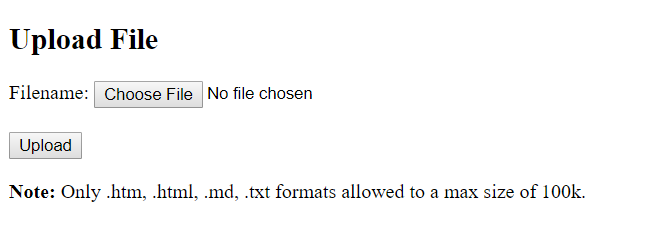
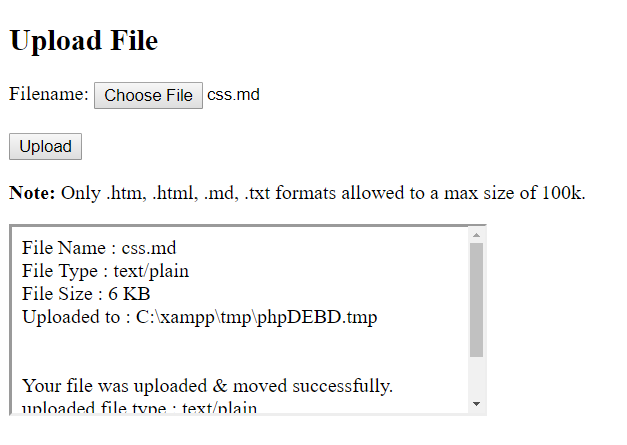
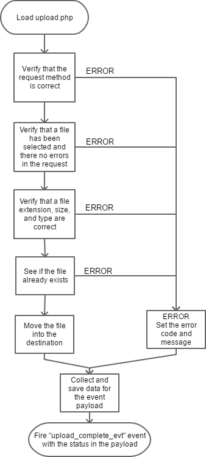
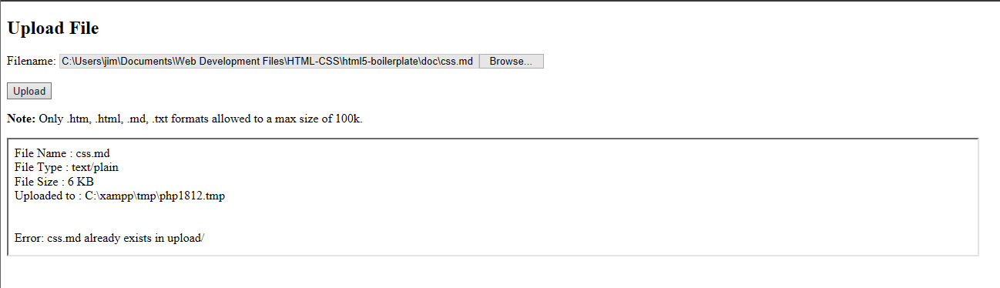

# php-file-upload

Notes and demonstration code for uploading files using PHP

# Table of Contents

* [History](#history)
* [Requirements](#requirements)
* [Application Overview](#application-overview)
    * [Changed Behaviors](#changed-behaviors)
* [Running the Application](#running-the-application)
    * [How it Works](#how-it-works)
        * [Load](#load)
        * [Begin Upload](#begin-upload)
        * [Upload File and Verify](#upload-file-and-verify)
        * [Respond with Status](#respond-with-status)
    * [Success Indicators](#success-indicators)
    * [Failure Indicators](#failure-indicators)
        * [Error Codes and Messages](#error-codes-and-messages)
        * [Trouble Shooting](#trouble-shooting)
    * [Browser Behaviors](#browser-behaviors)
        * [Chrome](#chrome)
        * [FireFox](#fireFox)
        * [Microsoft Edge](#nicrosoft-edge)
* [Things I Learned Along the Way](#things-i-learned-along-the-way)
    * [MIME Types](#mime-types)
    * [Browser Differences](#browser-differences)

# History

I had been looking for a way to upload files via my browser to my website. I could have used SFTP but this was to be part of a larger application. And that application required a means to upload files.

After reading and researching I came accross a tutorial (<https://www.tutorialrepublic.com/php-tutorial/php-file-upload.php>) that showed me what I needed to get started.

The code found in the *root* of this repository is my **modified** version of the original tutorial code. For reference purposes the original code can be found in the `/orig` folder in this repo.

Please keep in mind that purpose was to *customize* the original code to suit the requirements of my application.

# Requirements

The following is required in order to run this application :

* Text editor - to modify files as needed
* Web Server with PHP - I'm using XAMPP with PHP 5.6.31, a hosted server with PHP >= 5.0 will also work
* A web browser - I use Chrome for testing & debugging
* Miscellaneous files to upload (*.htm, .html, .md, and .txt*)


# Application Overview

This application consists of two PHP files - 

* index.php (*this file was named `file-upload-form.php`, the original can be found in `/orig`*)
* upload.php (*this file was named `upload-manager.php`, the original can be found in `/orig`*)

## Changed Behaviors

The following items have been modified : 

* File types - I've modified the original code to accept: .htm, .html, .md, and .txt *instead* of .jpg, .jpeg, .gif, and .png
* Added comments everywhere.

* `index.php` behavior:
    * The original code would redirect to the page output created by `upload.php` (*originally* `file-upload-form.php`). I've modified the form with `target="file-iframe"`.
    * Found a missing closing `>`, added it.
    * Changed the *name* of the `<input type="file">` tag from `photo` to `uploadfile`.
    * Added the style `style="width:25%;"` to `<input type="file">` so that the upload path+file is visible in browsers that display it.
    * Added an `iframe`, this will contain the output from `upload.php`.
    * Added a listener for an event trigger. This event is sent from `upload.php` and is used to indicate completion. It will be triggered on success or failure to upload. __*see details below*__
    * Added a *hidden* text field. It contains the upload destination path, and will be used instead of what *was* hardcoded previously.

* `upload.php` behavior :
    * Added an `else` to `if($_SERVER["REQUEST_METHOD"] == "POST")`.
    * Changed the uploaded file size calculation from `($filesize / 1024)` to `(($filesize / 1024) | 0)` which removes digits to the *right* of the decimal point.
    * The logic around the calls to `die()` have been rewritten to fall through to the event trigger. The event payload contains an error code and an error message string.

# Running the Application

Place the following into a folder within the *document root* of your server -

```
/ document root folder
      |
      ---- test/                <- you will create this folder
              |
              ---- index.php    <- add this files to the new folder
              |
              ---- upload.php   <- add this one
              |
              ---- phpinfo.php  <- and this one too
              |
              ---- upload/      <- this folder must be created              
```

**NOTE :** I was using *Chrome* during the following steps :

Open your browser and point it to the server - `http://your-server/test/`

You *should* see the following - 

<p align="center">
  
</p>

The click on the **Choose File** button and select a file to upload. This application will accept .htm, .html, .md, and .txt files.

Once you've seleted a file its name will appear next to the **Choose File** button.

Then click the **Upload** button and you should see this - 

<p align="center">
  
</p>

## How it Works

### Load `index.pgp`

<p align="center">
  
</p>

### Begin Upload

<p align="center">
  
</p>

### Upload File and Verify

<p align="center">
  
</p>

### Respond with Status

<p align="center">
  
</p>

## Success Indicators

This time open the *developers tool* window by right-clicking anywhere on the displayed page. Refresh the browser to reload the page. Then run the application again and upload a different file. Notice the console pane in the developer tool window, and should see output similar to this - 

`GOT IT : {"file":"css.md","type":"text/plain","size":6826,"path":"upload/","status":{"msg":"The file css.md uploaded successfully","code":0}}`

Here's the same output JSON, but just a little *prettier* - 

```
{
  "file": "css.md",
  "type": "text/plain",
  "size": 6826,
  "path": "upload/",
  "status": {
    "msg": "The file css.md uploaded successfully",
    "code": 0
  }
}
```

Success! The file was uploaded without any errors.

## Failure Indicators

If `{status : {code}}` is any value *less than zero* an error has occured. Here's an example of what the JSON looks like due to an error - 

```
{
  "file": "temp.log",
  "type": "text/plain",
  "size": 6826,
  "path": "upload/",
  "status": {
    "msg": "Please select a valid file format, .log is not allowed",
    "code": -5
  }
}
```

### Error Codes and Messages

The following errors are possible, and announced via the data sent in the `upload_complete_evt` event.

* **msg:** "The file FILE.EXT uploaded successfully" **code:** 0
* **msg:** "FILE.EXT already exists in PATH" **code:** -1
* **msg:** "the file type .EXT is not allowed" **code:** -2 
* **msg:** upload error - ERROR_INFO"" **code:** -3
* **msg:** "bad request - METHOD" **code:** -4
* **msg:** "Please select a valid file format, .EXT is not allowed" **code:** -5
* **msg:** "File size of XXXX is larger than the allowed limit of YYYY" **code:** -6
* **msg:** "The file FILE.EXT could not be moved to PATH" **code:** -7

Most of the messages are self explanatory, but here is the meaning of the text in upper case :

* FILE.EXT - the file name plus extension of the file that was to be uploaded
* PATH - the final destination of the uploaded file
* .EXT - the extension of the uploaded file
* ERROR_INFO - a string obtained in `upload.php`, it comes from `$_FILES["uploadfile"]["error"]`
* METHOD - the method used when `upload.php` was requested
* XXXX - the size in bytes of the file
* YYYY - the maximum size allowed for uploads

### Trouble Shooting

Try checking the following - 

* Does your server have PHP installed? Load the `phpinfo.php` file to check.
* Is the file type (*extension*) allowed by `upload.php`?
* Is the file too large? The limit is 100k.
* Does the `upload` folder exist where `index.php` and `upload.php` are kept?
* Did you have a *good* breakfast today?

## Browser Behaviors

I tested with three browsers : 

* FireFox 55.0.3 (64-bit)
* Google Chrome 61.0.3163.91 (Official Build) (64-bit) - my primary testing & debug browser
* Microsoft Edge 40.15063.0.0

### Chrome

The page images used in this document came from a Chrome rendering of the page(s);

### FireFox

FireFox pretty much looks and operates the same as Chrome.

### Microsoft Edge

This is a little different. After the file is selected the path + file name will show up in a read-only text-like control to the left of the *Browse...* button.

<p align="center">
  
</p>

# Things I Learned Along the Way

Here are some things I learned as I worked on the code for this application...

##  MIME Types

After I had read through a few sources it appeared to me that t using the browser supplied MIME type is unreliable. 
That's because Windows (*or the OS hosting browser*) determines the MIME type. You can view some of the types using regedit. Go to - 

   `Computer\HKEY_CLASSES_ROOT\MIME\Database\Content Type`

to see the default types. 

**IMPORTANT:** I do NOT recommend editing any of the registry entries.

It appears that if a file type (".md" for example) isn't found in the registry that the default type will be  `application/octet-stream`.

It's probably better to call the PHp function **mime_content_type()** to determine the file's MIME type *after it's been uploaded*. 

Here are a couple of resources that I found informative :

<http://php.net/manual/en/features.file-upload.post-method.php>

<https://stackoverflow.com/questions/1201945/how-is-mime-type-of-an-uploaded-file-determined-by-browser>

## Browser Differences

In addition to what was mentioned previously I have also noticed that the file dialog is different between FireFox and Chrome. In Firefox the discrete file types are seen in the drop-down. But in chrome you will only see "Custom Files".

It's even more different in IE/Edge, there when a file is selected IE/Edge will display the file path in a read-only text box to the left of the file selection button (*which is also labeled differently*).


