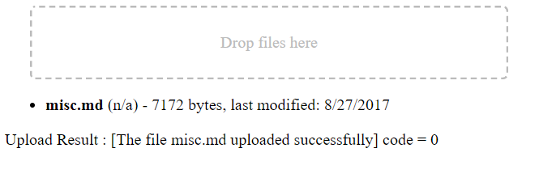

# php-file-upload

Notes and demonstration code for uploading files using PHP

# Table of Contents

* [History](#history)
* [Requirements](#requirements)
* [Application Overview](#application-overview)
* [Running the Application](#running-the-application)
    * [Form Based File Upload](#form-based-file-upload)
        * [Upload Complete Event](#upload-complete-event)
    * [Drag and Drop File Upload](#drag-and-drop-file-upload)
        * [Drag and Drop Upload Response](#drag-and-drop-upload-response)
    * [Success Indicators](#success-indicators)
    * [Failure Indicators](#failure-indicators)
        * [Error Codes and Messages](#error-codes-and-messages)
        * [Trouble Shooting](#trouble-shooting)
    * [Choosing an HTML or JSON POST Response](#choosing-an-html-or-json-post-response)
    * [Changing the Upload Path](#changing-the-upload-path)
* [Browser Behaviors](#browser-behaviors)
    * [Chrome](#chrome)
    * [FireFox](#fireFox)
    * [Microsoft Edge](#nicrosoft-edge)
        * [Upload Via Form](#upload-via-form)
        * [Upload Via Drag and Drop](#upload-via-drag-and-drop)
    * [Additional Differences](#additional-differences)
* [Things I Learned Along the Way](#things-i-learned-along-the-way)
    * [MIME Types](#mime-types)
* [Summary](#summary)

# History

I had been looking for a way to upload files via a browser to my website. I could have used SFTP instead but this was to be part of a larger application. And that application required a way to upload files.

After reading and researching I came accross a tutorial (<https://www.tutorialrepublic.com/php-tutorial/php-file-upload.php>) that showed me what I needed to get started.

From that information I was able to create the first upload demo. It's form based and can upload *one* file at a time. 

As I was reviewing the implementation details for my application I decided that uploading more than one file at a time would be better. And after a bit more reading and experimentation I determined that having the ability to "drag and drop" files for upload was exactly what I wanted.

So that led me to another tutorial at <https://www.html5rocks.com/en/tutorials/file/dndfiles/> which explained how a drag and drop worked.

The code found in the *root* of this repository is my **modified** version of the original tutorial code that I had found. For reference purposes the original code can be found in the `/orig` folder in this repo.

Please keep in mind that purpose was to *customize* the original code to suit the requirements of my application. And those are - 

* Easily and quickly upload one or more files
* Client code must be easily adapted to fully programmatic operation
* The code must be flexible enough to manage file upload forms and other upload methods (*i.e. drag and drop*)
* The upload code must return a status after the upload operation is complete

# Requirements

The following is required in order to run this application :

* Web Server with PHP - I'm using XAMPP with PHP 5.6.31, a hosted server with PHP >= 5.0 will also work
* A web browser - I use Chrome for testing & debugging
* Miscellaneous files to upload (*.htm, .html, .md, and .txt*)

# Application Overview

There are 2 demo applications :

* Form based file upload, one file at a time
    * index.php

* Drag and drop file upload, one or more files at a time - 
    * index-dnd.html

Both demos send a POST request for `upload.php` to achieve an upload. And the type of response that `upload.php` returns is selectable by the client. The two choices are - 

* JSON string
* HTML file, with an event that passes a JSON object. However in order to receive the event the form `target` should point to an *iframe*.

# Running the Applications

Place the following files into a folder within the *document root* of your server -

```
/ document root folder
      |
      ---- test/                    <- you will create this folder and
              |                        add the remaining files and folder
              |
              ---- index.php        <- file picking form demo
              |
              ---- index-dnd.html   <- file drag and drop demo
              |
              ---- upload.pnp       <- POST request handler
              |
              |
              ---- phpinfo.php      <- and this one too, just in case
              |
              ---- upload/          <- this folder must be created before uploading            
```

## Form Based File Upload

**NOTE :** I was using *Chrome* during the following steps :

Open your browser and point it to the server - `http://your-server/test/`

You *should* see the following - 

<p align="center">
  
</p>

The click on the **Choose File** button and select a file to upload. This application will accept .htm, .html, .md, and .txt files.

Once you've seleted a file its name will appear next to the **Choose File** button.

Then click the **Upload** button and you should see something like this - 

<p align="center">
  
  <br><i>this image may differ from the application</i>
</p>

### Upload Complete Event

After the file upload operation has completed, regardless of success or failure an event is triggered in `upload.php`. However it will only be recieved if the form in `index.php` has its target pointing to an iframe tag.

This event also carries some data in the form of an object. To see its contents open the *developer tools* for your browser and observe the *console*. You should see something like this - 

```
GOT IT : {"detail": {"file": "faq.md", "type": "text/html", "size": 2056, "path": "upload/", "status": {"msg": "The file faq.md uploaded successfully", "code": 0}}}
```

## Drag and Drop File Upload

**NOTE :** I was using *Chrome* during the following steps :

Open your browser and point it to the server - `http://your-server/test/index-dnd.html`

You *should* see the following - 

<p align="center">
  
</p>

Open a file explorer and navigate to a folder were you have some *.htm, *.html, *.txt, or *.md files. Select and drag one of the files into the dash bordered box and release it. You should see something like this - 

<p align="center">
  
</p>

### Drag and Drop Upload Response

After the file upload operation has completed, regardless of success or failure `upload.php` will respond with a JSON string. You should see something like this -

```
GOT IT : {"detail": {"file": "faq.md", "type": "text/html", "size": 2056, "path": "upload/", "status": {"msg": "The file faq.md uploaded successfully", "code": 0}}}
```

## Success Indicators

This section covers both upload methods.

This time open the *developers tool* window by right-clicking anywhere on the displayed page. Refresh the browser to reload the page. Then run the application again and upload a different file. Notice the console pane in the developer tool window, and should see output similar to this - 

`GOT IT : {"file":"css.md","type":"text/plain","size":6826,"path":"upload/","status":{"msg":"The file css.md uploaded successfully","code":0}}`

Here's the same output JSON, but just a little *prettier* - 

```
{
  "file": "css.md",
  "type": "text/plain",
  "size": 6826,
  "path": "upload/",
  "status": {
    "msg": "The file css.md uploaded successfully",
    "code": 0
  }
}
```

Success! The file was uploaded without any errors.

## Failure Indicators

If `{status : {code}}` is any value *less than zero* an error has occured. Here's an example of what the JSON looks like due to an error - 

```
{
  "file": "temp.log",
  "type": "text/plain",
  "size": 6826,
  "path": "upload/",
  "status": {
    "msg": "Please select a valid file format, .log is not allowed",
    "code": -5
  }
}
```

### Error Codes and Messages

The following errors are possible, and announced via the data sent in the `upload_complete_evt` event **or** via the POST response.

* **msg:** "Bad request - METHOD" **code:** -1
* **msg:** "Upload error - ERROR_INFO" **code:** -2
* **msg:** "Please select a valid file format, .EXT is not allowed" **code:** -3
* **msg:** "The file type MIMETYPE is not allowed" **code:** -4
* **msg:** "File size of XXXX is larger than the allowed limit of YYYY" **code:** -5
* **msg:** "A file named FILE.EXT already exists in PATH" **code:** -6
* **msg:** "The file FILE.EXT could not be moved to PATH" **code:** -7
* **msg:** "The file FILE.EXT uploaded successfully" **code:** 0

Most of the messages are self explanatory, but here is the meaning of the text in upper case :

* FILE.EXT - the file name plus extension of the file that was to be uploaded
* PATH - the final destination of the uploaded file
* .EXT - the extension of the uploaded file
* MIMETYPE - a MIME type string like "text/plain".
* ERROR_INFO - a string obtained in `upload.php`, it comes from `$_FILES["uploadfile"]["error"]`
* METHOD - the method used when `upload.php` was requested
* XXXX - the size in bytes of the file
* YYYY - the maximum size allowed for uploads

### Trouble Shooting

Try checking the following - 

* Does your server have PHP installed? Load the `phpinfo.php` file to check.
* Is the file type (*extension*) allowed by `upload.php`?
* Is the file too large? The limit is 100k.
* Does the `upload` folder exist where `index.php` and `upload.php` are kept?
* Did you have a *good* breakfast today?

## Choosing an HTML or JSON POST Response

There is a data item in the POST request called `rtype` (*response type*). In the form it's kept in a hidden input - 

```
<input hidden type="text" id="uploadresp" name="rtype" value="html">
```

And in the no-form demo an item is added to the `FormData` - 

```
fd.append('rtype', 'json');
```

## Changing the Upload Path

The default path for uploads is `upload/`. And is set the same as the response type described above.

In the form - 

```
<input hidden type="text" id="uploadpath" name="path" value="upload/">
```

No-form - 

```
fd.append('path', 'upload/');
```

# Browser Behaviors

I tested with three browsers : 

* FireFox 55.0.3 (64-bit)
* Google Chrome 61.0.3163.91 (Official Build) (64-bit) - my primary testing & debug browser
* Microsoft Edge 40.15063.0.0

## Chrome

The page images used in this document came from a Chrome rendering of the page(s);

## FireFox

FireFox pretty much looks and operates the same as Chrome.

## Microsoft Edge

### Upload Via Form

This is a little different. After the file is selected the path + file name will show up in a read-only text-like control to the left of the *Browse...* button.

<p align="center">
  
</p>

### Upload via Drag and Drop

It seems that *Edge* does not support drag and drop. 

## Additional Differences

In addition to what was mentioned previously I have also noticed that the file dialog is different between FireFox and Chrome. In Firefox the discrete file types are seen in the drop-down. But in chrome you will only see "Custom Files".

# Things I Learned Along the Way 
 
Here are some things I learned as I worked on the code for this application... 
 
##  MIME Types 
 
After I had read through a few sources it appeared to me that t using the browser supplied MIME type is unreliable.  
That's because Windows (*or the OS hosting browser*) determines the MIME type. You can view some of the types using regedit. Go to -  
 
   `Computer\HKEY_CLASSES_ROOT\MIME\Database\Content Type` 
 
to *see* the default types.  
 
**IMPORTANT:** I do NOT recommend editing any of the registry entries. 
 
It appears that if a file type (".md" for example) isn't found in the registry that the default type will be  `application/octet-stream`. 
 
It's better to call the PHP function **mime_content_type()** to determine the file's MIME type *after it's been uploaded*.  
 
Here are a couple of resources that I found informative : 
 
<http://php.net/manual/en/features.file-upload.post-method.php> 
 
<https://stackoverflow.com/questions/1201945/how-is-mime-type-of-an-uploaded-file-determined-by-browser> 

# Summary

This was fun. It took me few days to tinker with the original code and create this repository. And I'm very happy with the results.


